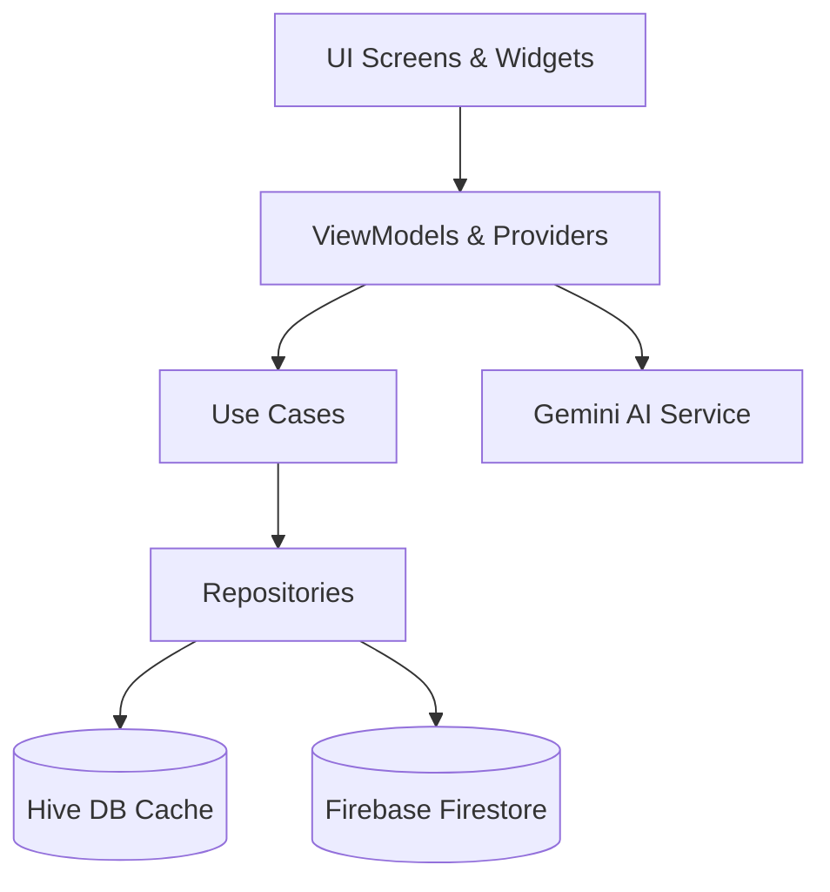

# Montage

> [!NOTE]
> **PROPRIETARY & CONFIDENTIAL**
> 
> © 2026 Zunaira Mughal. All rights reserved. Unauthorized cloning, distribution, or usage of this repository is strictly prohibited.

Montage is a professional-grade, dark-themed personal finance management application built with Flutter. Structured with a glassmorphic visual system, Montage integrates local capability with background cloud storage synchronization to deliver an offline-first financial tracking experience.

---

## 🛠️ Architecture & Tech Stack

Montage is structured around **Clean Architecture** principles combined with the **MVVM (Model-View-ViewModel)** design pattern. It enforces a strict separation of concerns, ensuring high testability, modularity, and database agility.



### Stack Components

| Layer | Technology | Purpose |
|---|---|---|
| **Framework** | [Flutter](https://flutter.dev/) (Dart 3+) | Multi-platform application execution engine |
| **State Management** | [Provider](https://pub.dev/packages/provider) | Reactive state container mapping ViewModels/Providers to UI |
| **Routing** | [GoRouter](https://pub.dev/packages/go_router) | Declarative routing with custom sliding page transitions |
| **Local Storage** | [Hive](https://pub.dev/packages/hive) | High-performance NoSQL database storage caching for offline speed |
| **Remote Database** | [Cloud Firestore](https://firebase.google.com/docs/firestore) | Real-time multi-device cloud records persistence |
| **Authentication** | [Firebase Auth](https://firebase.google.com/docs/auth) | Secure user credential management and session verification |
| **Cloud Storage** | [Firebase Storage](https://firebase.google.com/docs/storage) | Remote persistence for uploaded receipt attachments |
| **AI Insights** | [Google Generative AI](https://pub.dev/packages/google_generative_ai) | Contextual financial mentor suggestions using `gemini-1.5-flash` |
| **Security** | [Local Auth](https://pub.dev/packages/local_auth) | Local biometric protection (FaceID / Fingerprint) with PIN fallback |
| **Data Visualization**| [FL Chart](https://pub.dev/packages/fl_chart) | Dynamic analytical charts for category and weekly trends |
| **Voice Processing** | [Speech to Text](https://pub.dev/packages/speech_to_text) | Urdu and English voice dictation for transaction details |
| **Haptic Feedback** | Native Services | Tactile physical click responses for keypad inputs and screen transitions |
| **Animations** | [Flutter Animate](https://pub.dev/packages/flutter_animate) | Smooth transitions, micro-interactions, and skeleton loading animations |

---

## 🌟 Core Features

### 1. Dual-Database Synchronization (Offline-First)
* **Instant Operations**: Reads and writes target local **Hive** boxes immediately without network roundtrips.
* **Background Sync**: Changes are pushed to Firestore asynchronously using a synchronization service, preserving local modifications and resolving cloud states upon re-establishing connection.
* **User Isolation**: Hive boxes are dynamically initialized and segmented by naming conventions mapped to the user's unique Firebase UID (e.g., `transactions_$userId`, `user_settings_$userId`, `custom_categories_$userId`).

### 2. Intelligent Expression Keypad & Voice Dictation
* **Math Expression Parser**: Evaluates math expressions (`+`, `-`, `*`, `/`) directly inside the custom keypad before committing transaction amounts.
* **Bi-lingual Voice Dictation**: Converts Urdu or English voice input to text for transaction notes and category titles, toggled via a long-press on the microphone button.
* **Integrated Inputs**: Date selector and camera shortcuts are accessible directly within the keypad interface.

### 3. Media & Receipt Handling
* **High-Res Attachments**: Select and capture receipts using the camera or gallery.
* **Fullscreen Viewer**: Renders receipt images in a dedicated view with native zoom/pan capabilities.
* **Bandwidth Optimization**: Utilizes `CachedNetworkImage` for network caching, preserving offline viewing of previously loaded receipts.

### 4. Generative AI Financial Mentor
* **Critiques**: Uses `gemini-1.5-flash` to parse up to 15 recent transactions, outputting structured 25-word financial warnings or savings encouragement.
* **Local Fallback**: Implements randomized financial reminders if connection errors or rate limits prevent contacting the Gemini API.

### 5. Multi-Select Actions & Swipe Gestures
* **Fluid Gestures**: Slide transactions in home or history lists to edit or delete them.
* **Batch Operations**: Select multiple transactions simultaneously to delete or export them.
* **Soft Delete Safety Net**: Moves deleted transactions to an archive box instead of immediate deletion, allowing users to restore records in a single tap.

### 6. Interactive Analytics & Export Engine
* **Visual Breakdowns**: Category allocations and weekly balance trends are represented via interactive pie and bar charts.
* **Data Exporters**: Formats and exports transactions to PDF reports, CSV files (Excel friendly), or plain text.

---

## 📂 Project Directory Structure

```
lib/
├── config/              # Centralized GoRouter navigation configurations and AuthWrapper
├── core/
│   ├── config/          # App-wide config constraints
│   ├── constants/       # Color tokens, shadows, asset keys, and preference keys
│   ├── di/              # MultiProvider injection tree configuration
│   ├── enums/           # Internal enumeration mappings
│   ├── errors/          # Custom exceptions and logging controls
│   ├── interfaces/      # Abstract contracts for Repositories and Services
│   ├── themes/          # Custom dark themes, Nunito typography, and glassmorphic styles
│   └── utils/           # Helper utilities (App Logger, Haptics feedback helper, Date parser)
├── domain/              # Clean Architecture core business logic layer
│   ├── entities/        # Core business data constructs (Transaction)
│   └── use_cases/       # Interactors representing operations (e.g., SoftDeleteTransaction)
├── models/              # Type-safe Hive model adapters and mapping utilities
├── providers/           # State management providers holding controller logic
├── repositories/        # Core implementation of data syncing between Hive and Firestore
├── screens/             # Presentation UI views (Home, Onboarding, Analytics, Settings, etc.)
├── services/            # Low-level service implementations (Biometrics, AI, File Export, Media)
├── viewmodels/          # Form states and UI-level interaction logic
└── widgets/             # Reusable UI components (Glass Container, custom keypad, skeletons)
```

---

## 🚀 Setup & Installation

### Prerequisites
* Flutter SDK (`^3.8.1` or higher)
* Dart SDK (`^3.0.0` or higher)
* Configured Firebase Project

### 1. Clone the Repository
```bash
git clone https://github.com/ZunairaMughal24/PersonaL_finance_tracker.git
cd PersonaL_finance_tracker
```

### 2. Environment Configuration
Create a `.env` file in the root directory:
```env
GEMINI_API_KEY=your_gemini_api_key_here
```

Configure Firebase dependencies for Android/iOS/Web using FlutterFire CLI:
```bash
flutterfire configure
```

### 3. Generate Hive Adapters
Run code generation to compile database adapters:
```bash
flutter pub get
flutter pub run build_runner build --delete-conflicting-outputs
```

### 4. Run the Application
Launch on a connected device:
```bash
flutter run
```

---

## 🧪 Testing

Execute the test suites targeting utility calculations and data formats:
```bash
flutter test
```

---

*Built by Zunaira Mughal*
